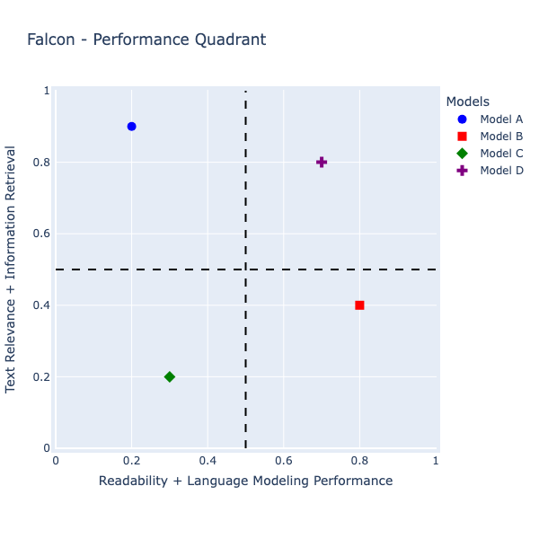

<div align="center">
  
</div>

# Falcon Evaluate

### A Low-Code LLM - RAG Evaluation Solution

[](LICENSE)
[](https://github.com/Praveengovianalytics/falcon_evaluate)
[](https://github.com/Praveengovianalytics/falcon-evaluate/issues)
[](https://github.com/Praveengovianalytics/falcon-evaluate/releases)
<a href="https://colab.research.google.com/drive/1h9E0Q5Fema9TkOiv0asyaSaHin1R0UN5?usp=sharing">

[](https://github.com/Praveengovianalytics/falcon-evaluate)
</a>
<a href="https://www.python.org/">

</a>

<h4 align="center">
    <p>
        <a href="#shield-installation">Installation</a> |
        <a href="#fire-quickstart">Quickstart</a> |
    <p>
</h4>


# Falcon Evaluate - A Language Language Model ( LLM ) Validation Library

## Overview
Falcon Evaluate is an open-source Python library  aims to revolutionize the LLM - RAG evaluation process by offering a low-code solution. Our goal is to make the evaluation process as seamless and efficient as possible, allowing you to focus on what truly matters.This library aims to provide an easy-to-use toolkit for assessing the performance, bias, and general behavior of LLMs in various natural language understanding (NLU) tasks.

## :shield: Installation

```bash
pip install falcon_evaluate -q
```


if you want to install from source

```bash
git clone https://github.com/Praveengovianalytics/falcon_evaluate && cd falcon_evaluate
pip install -e .
```


## :fire: Quickstart

###  Google Colab notebook

- [Get start with falcon_evaluate](https://colab.research.google.com/drive/1h9E0Q5Fema9TkOiv0asyaSaHin1R0UN5?usp=sharing)

```python
# Example usage

!pip install falcon_evaluate -q

from falcon_evaluate.fevaluate_results import ModelScoreSummary
from falcon_evaluate.fevaluate_plot import ModelPerformancePlotter
import pandas as pd
import nltk
nltk.download('punkt')

########
# NOTE
########

# Make sure that your validation dataframe should have "prompt" & "reference" column & rest other columns are model generated responses

df = pd.DataFrame({
    'prompt': [
        "What is the capital of France?"
    ],
    'reference': [
        "The capital of France is Paris."
    ],
    'Model A': [
        "Paris is the capital of France.
    ],
    'Model B': [
        "Capital of France is Paris."
    ],
    'Model C': [
        "Capital of France was Paris."
    ],
})

model_score_summary = ModelScoreSummary(df)
result,agg_score_df = model_score_summary.execute_summary()
print(result)

ModelPerformancePlotter(agg_score_df).get_falcon_performance_quadrant()

```
<div align="left">
  
</div>

#### Note - Same model with different config settings can be plotted for qualification to specific usecase.

# Model Evaluation Results

The following table shows the evaluation results of different models when prompted with a question. Various scoring metrics such as BLEU score, Jaccard similarity, Cosine similarity, and Semantic similarity have been used to evaluate the models. Additionally, composite scores like Falcon Score have also been calculated.

To dive in more detail to evaluation metric, refer below link 

[falcon-evaluate metrics in detail](https://praveengovianalytics.github.io/falcon-evaluate.github.io/)

## Evaluation Data

| Prompt                         | Reference                     |
|--------------------------------|-------------------------------|
| What is the capital of France? | The capital of France is Paris.|

## Model A Evaluation

#### Readability and Complexity

- ARI: 2.7
- Flesch-Kincaid Grade Level: 2.9

#### Language Modeling Performance

- Perplexity: 112.17

#### Text Toxicity

- Toxicity Level: 0.09

#### Text Similarity and Relevance

- BLEU: 0.64
- Cosine Similarity: 0.85
- Semantic Similarity: 0.99
- Jaccard Similarity: 0.71

#### Information Retrieval

- Precision: 0.83
- Recall: 0.71
- F1-Score: 0.77

## Falcon Score (Model A)

## Evaluation Categories Metrics

Below are the computed metrics categorized under different evaluation categories:

### Readability and Complexity

- Arithmetic Mean: 1.65
- Weighted Sum: 1.65
- Geometric Mean: 1.59
- Harmonic Mean: 1.53
- T-Statistic: 2.12
- P-Value: 0.28
- F-Score: 0.00
- Z-Score Normalization: [-1.00, 1.00]

### Language Modeling Performance

- Arithmetic Mean: 19.45
- Weighted Sum: 19.45
- Geometric Mean: 19.45
- Harmonic Mean: 19.45
- T-Statistic: NaN
- P-Value: NaN
- F-Score: 0.00
- Z-Score Normalization: [NaN]

### Text Toxicity

- Arithmetic Mean: 0.046
- Weighted Sum: 0.046
- Geometric Mean: 0.046
- Harmonic Mean: 0.046
- T-Statistic: NaN
- P-Value: NaN
- F-Score: 0.00
- Z-Score Normalization: [NaN]

### Text Similarity and Relevance

- Arithmetic Mean: 0.67
- Weighted Sum: 0.67
- Geometric Mean: 0.00
- Harmonic Mean: 0.00
- T-Statistic: 1.29
- P-Value: 0.29
- F-Score: 0.00
- Z-Score Normalization: [-1.67, 0.82, 0.73, 0.11]

### Information Retrieval

- Arithmetic Mean: 0.77
- Weighted Sum: 0.77
- Geometric Mean: 0.77
- Harmonic Mean: 0.77
- T-Statistic: 11.23
- P-Value: 0.01
- F-Score: 0.77
- Z-Score Normalization: [1.25, -1.19, -0.06]


## Model B Evaluation

| Response                    | Scores |
|-----------------------------|--------|
| Capital of France is Paris. |  |

## Model B Evaluation scores

### Readability and Complexity:
- **ARI**: 2.7
- **Flesch-Kincaid Grade Level**: 2.9

### Language Modeling Performance:
- **Perplexity**: 112.17

### Text Toxicity:
- **Toxicity Level**: 0.09

### Text Similarity and Relevance:
- **BLEU**: 0.64
- **Cosine Similarity**: 0.85
- **Semantic Similarity**: 0.99
- **Jaccard Similarity**: 0.71

### Information Retrieval:
- **Precision**: 0.83
- **Recall**: 0.71
- **F1-Score**: 0.77


## 📊 Reliability - Hallucination Score 🤖

The `falcon_evaluate` library introduces a crucial feature for evaluating the reliability of text generation models - the **Hallucination Score**. This feature, part of the `Reliability_evaluator` class, computes hallucination scores indicating the extent to which the generated text deviates from a given reference in terms of factual accuracy and relevance.

### 🌟 What is Hallucination Score?

Hallucination Score measures the reliability of sentences generated by AI models. A high score suggests a close alignment with the reference text, indicating factual and contextually accurate generation. Conversely, a lower score may indicate 'hallucinations' or deviations from the expected output.

### 🚀 How to Use

1. **Import and Initialize** 🛠️: Start by importing the `Reliability_evaluator` class from the `falcon_evaluate.fevaluate_reliability` module and initialize the evaluator object.

    ```python
    from falcon_evaluate.fevaluate_reliability import Reliability_evaluator

    Reliability_eval = Reliability_evaluator()
    ```

2. **Prepare Your Data** 📝: Your data should be in a pandas DataFrame format with columns representing the prompts, reference sentences, and outputs from various models.

    ```python
    import pandas as pd

    # Example DataFrame
    data = {
        "prompt": ["What is the capital of Portugal?"],
        "reference": ["The capital of Portugal is Lisbon."],
        "Model A": ["Lisbon is the capital of Portugal."],
        "Model B": ["Portugal's capital is Lisbon."],
        "Model C": ["Is Lisbon the main city of Portugal?"]
    }
    df = pd.DataFrame(data)
    ```

3. **Compute Hallucination Scores** 💻: Use the `predict_hallucination_score` method to compute the hallucination scores.

    ```python
    results_df = Reliability_eval.predict_hallucination_score(df)
    print(results_df)
    ```

    This will output the DataFrame with additional columns for each model showing their respective hallucination scores:

| Prompt                               | Reference                             | Model A                               | Model B                             | Model C                                  | Model A Reliability Score              | Model B Reliability Score              | Model C Reliability Score              |
|--------------------------------------|---------------------------------------|---------------------------------------|-------------------------------------|-----------------------------------------|----------------------------------------|----------------------------------------|----------------------------------------|
| What is the capital of Portugal?     | The capital of Portugal is Lisbon.    | Lisbon is the capital of Portugal.    | Portugal's capital is Lisbon.       | Is Lisbon the main city of Portugal?    | {'hallucination_score': 1.0}           | {'hallucination_score': 1.0}           | {'hallucination_score': 0.22}          |


### 📈 Understanding the Hallucination Scores  

- **High Score** (🟢): Approaches to -> 1 , Indicates strong alignment with the reference, suggesting factual accuracy.
- **Low Score** (🔴): Approaches to -> 0 , Suggests potential deviations from the factual content of the reference text.

Leverage the Hallucination Score feature to enhance the reliability of your AI LLM text generation capabilities ! 🚀


### Kindly refer the google colab notebook for more details
## Key Features

1. **Benchmarking:** Falcon Evaluate provides a set of pre-defined benchmarking tasks commonly used for evaluating LLMs, including text completion, sentiment analysis, question answering, and more. Users can easily assess model performance on these tasks.

2. **Custom Evaluation:** Users can define custom evaluation metrics and tasks tailored to their specific use cases. Falcon Evaluate provides flexibility for creating custom test suites and assessing model behavior accordingly.

3. **Interpretability:** The library offers interpretability tools to help users understand why the model generates certain responses. This can aid in debugging and improving model performance.

4. **Scalability:** Falcon Evaluate is designed to work with both small-scale and large-scale evaluations. It can be used for quick model assessments during development and for extensive evaluations in research or production settings.

## Use Cases
- Model Development: Falcon Evaluate can be used during the development phase to iteratively assess and improve the performance of LLMs.
- Research: Researchers can leverage the library to conduct comprehensive evaluations and experiments with LLMs, contributing to advancements in the field.
- Production Deployment: Falcon Evaluate can be integrated into NLP pipelines to monitor and validate model behavior in real-world applications.

## Getting Started
To use Falcon Evaluate, users will need Python and dependencies such as TensorFlow, PyTorch, or Hugging Face Transformers. The library will provide clear documentation and tutorials to assist users in getting started quickly.

## Community and Collaboration
Falcon Evaluate is an open-source project that encourages contributions from the community. Collaboration with researchers, developers, and NLP enthusiasts is encouraged to enhance the library's capabilities and address emerging challenges in language model validation.

## Project Goals
The primary goals of Falcon Evaluate are to:
- Facilitate the evaluation and validation of Language Models.
- Promote transparency and fairness in AI by detecting and mitigating bias.
- Provide an accessible and extensible toolkit for NLP practitioners and researchers.

## Conclusion
Falcon Evaluate aims to empower the NLP community with a versatile and user-friendly library for evaluating and validating Language Models. By offering a comprehensive suite of evaluation tools, it seeks to enhance the transparency, robustness, and fairness of AI-powered natural language understanding systems.


Project Organization
------------

    ├── LICENSE
    ├── Makefile           <- Makefile with commands like `make data` or `make train`
    ├── README.md          <- The top-level README for developers using this project.
    │
    ├── docs               <- A default Sphinx project; see sphinx-doc.org for details
    │
    ├── models             <- Trained and serialized models, model predictions, or model summaries
    │
    ├── notebooks          <- Jupyter notebooks. Naming convention is a number (for ordering),
    │                         the creator's initials, and a short `-` delimited description, e.g.
    │                         `1.0-jqp-initial-data-exploration`.
    │
    ├── references         <- Data dictionaries, manuals, and all other explanatory materials.
    │
    ├── requirements.txt   <- The requirements file for reproducing the analysis environment, e.g.
    │                         generated with `pip freeze > requirements.txt`
    │
    ├── setup.py           <- makes project pip installable (pip install -e .) so src can be imported
    ├── falcon_evaluate    <- Source code for use in this project.
    │   ├── __init__.py    <- Makes src a Python module
    │   │
    │
    └── tox.ini            <- tox file with settings for running tox; see tox.readthedocs.io


--------
